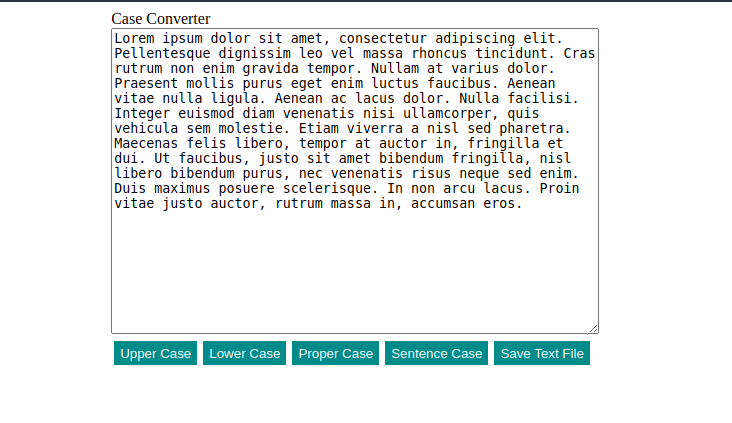

# CaseConverter App

## Table of Contents
* [General Info](#general-information)
* [Technologies Used](#technologies-used)
* [Features](#features)
* [Screenshots](#screenshots)
* [Setup](#setup)
<!-- * [Usage](#usage) -->
* [Project Status](#project-status)
<!-- * [Room for Improvement](#room-for-improvement) -->
* [Acknowledgements](#acknowledgements)
* [Contact](#contact)

## General Information
- App is used to keep score in ping pong match
- The main reason to create this app was to learn JavaScript basics

## Technologies Used
- HTML
- JavaScript
 
## Features
List the ready features here:
- Application should be able to convert a text into the upper case, lower case, proper case, and sentence case
  - The upper case is the case when each letter is in the upper case. 
    For example, 'THIS IS THE UPPER CASE TEXT.'
  - The lower case is the case when each letter is in the lower case. 
    For example, 'this is the lower case text.'
  -The proper case is the case when each word starts with the upper case, and the rest of the word is in the lower. 
    For example, 'This Is The Proper Case Text.'
  - The sentence case is the case when each sentence starts with an upper case letter, and the rest of the sentence is in the lower case. 
    In example, 'This is the sentence case. Only the first word of the sentence starts with an upper case letter.'
- Ability to save the changed text as a .txt file

## Screenshots
 
 
## Setup
To run this project copy repository and open index.html

## Project Status
Project is: completed 

## Acknowledgements
- This project was part of JetBrains Academy - Frontend Developer track.

## Contact
Created by Karol Kijowski
